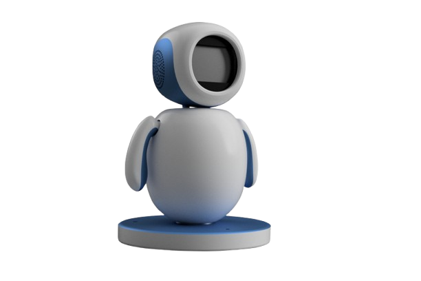
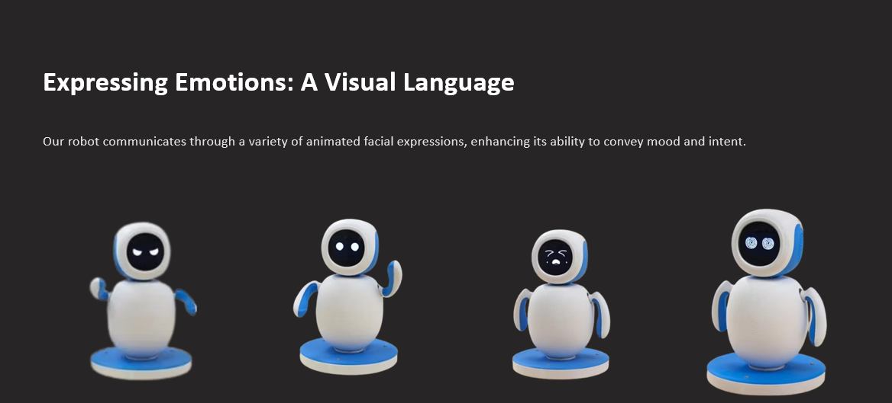
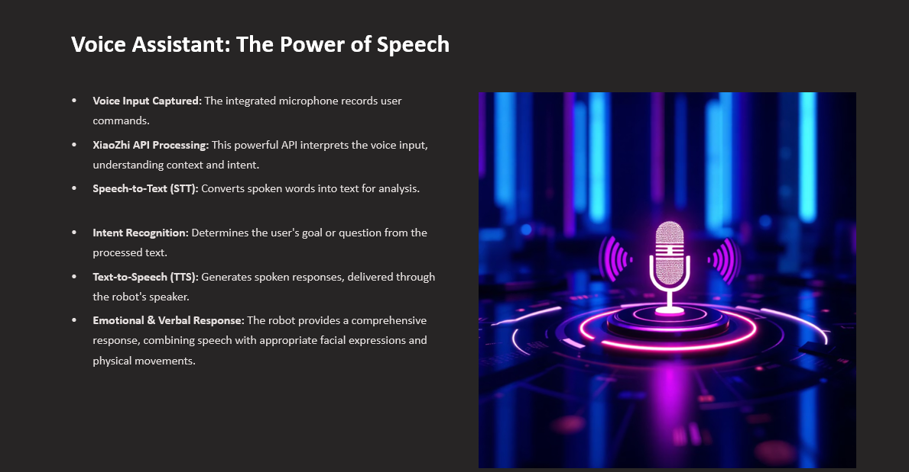
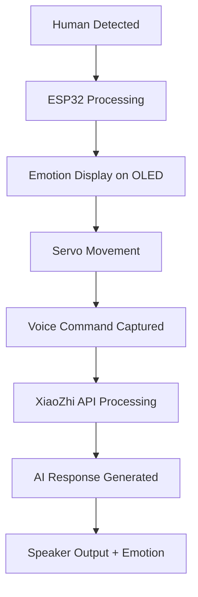

# 🤖 Kind Intelligence Bot (KIBO)

<div align="center">



### AI-Powered Emotional Interaction Robot


</div>

---

# 📌 Overview

**Kind Intelligence Bot (KIBO)** is an intelligent emotional interaction robot that combines:

- 🤖 Robotics
- 🧠 Artificial Intelligence
- 🌐 IoT
- 🎤 Voice Assistant
- 😊 Emotional Animations

The robot is capable of:

- Detecting human presence
- Displaying animated emotions
- Moving physically using servo motors
- Responding intelligently to voice commands

---

# 🎥 Demo Preview

## 🧠 Robot Emotion Display



## 🎤 Voice Assistant Working



## 🤖 Final Robot Assembly


---

# ✨ Features

| Feature | Description |
|---------|-------------|
| 👀 Motion Detection | Detects nearby humans |
| 😊 Emotion Display | Animated OLED expressions |
| 🎤 Voice Interaction | AI voice assistant support |
| 🔊 Audio Output | Smart verbal responses |
| 🤖 Servo Movement | Realistic robotic gestures |
| 🌐 IoT Connectivity | Wi-Fi enabled ESP32 |
| 🧠 AI Processing | XiaoZhi API integration |

---

# 🛠 Hardware Components

<div align="center">

| Component | Image | Purpose |
|----------|------|----------|
| ESP32 |  | Main Controller |
| OLED Display |  | Face Animation |
| Servo Motors |  | Movement |
| PIR Sensor |  | Motion Detection |
| Speaker |  | Voice Output |

</div>

---

# 💻 Technologies Used

## 🔹 Programming

- Embedded C/C++
- Arduino IDE

## 🔹 Hardware

- ESP32
- OLED SSD1306
- Servo Motors
- PIR Sensor

## 🔹 AI & IoT

- XiaoZhi API
- Wi-Fi Communication
- Speech-to-Text (STT)
- Text-to-Speech (TTS)

---

# ⚙️ Working Flow



---

# 🔌 Circuit Diagram

<div align="center">


</div>

---

# 🧠 Emotion System

The robot can express multiple emotions dynamically.

<div align="center">

| Happy | Sad | Angry | Neutral |
|------|------|------|------|
| 😊 | 😢 | 😠 | 😐 |

</div>

---

# 📂 Project Structure

```bash
KIBO/
│
├── assets/
│   ├── banner.png
│   ├── robot.png
│   ├── emotion-demo.png
│   ├── voice-demo.png
│   ├── circuit-diagram.png
│
├── code/
│   ├── main.ino
│   ├── oled.cpp
│   ├── voice.cpp
│
├── docs/
│   ├── presentation.pptx
│
├── circuit/
│   ├── wiring.png
│
├── README.md
```

---

# 🚀 Installation Guide

## 1️⃣ Clone Repository

```bash
git clone https://github.com/your-username/KIBO.git
```

---

## 2️⃣ Open Arduino IDE

Install:

- ESP32 Board Package
- Required Libraries

### Required Libraries

```bash
Adafruit SSD1306
Adafruit GFX
ESP32Servo
WiFi
```

---

## 3️⃣ Connect ESP32

Select:

```bash
Board: ESP32 Dev Module
```

Choose the correct COM Port.

---

## 4️⃣ Upload Code

Click the Upload Button in Arduino IDE.

---

# 🌐 Future Enhancements

- 🔥 ChatGPT Integration
- 📷 Face Recognition
- 📱 Mobile App Control
- 🧠 AI Emotion Detection
- 🔋 Battery Optimization

---

# 👨‍💻 Team Members

| Name | Role |
|------|------|
| Kunal Katre | Development |
| Sakshi | Hardware & Documentation |
| Udhay | Testing & Assembly |

---

# 🎓 Guided By

**Dr. Pinaki Ghosh**

Department of Computer Science & Technology  
SAGE University Bhopal

---

# 📜 License

This project is licensed for educational and research purposes.

---

# ⭐ Support

If you like this project:

- 🌟 Star this repository
- 🍴 Fork this repository
- 📢 Share with others

---

# 📬 Contact

📧 Email: your-email@example.com  
🔗 LinkedIn: https://linkedin.com/in/yourprofile

---

<div align="center">

## ❤️ Made with Passion & Innovation

</div>